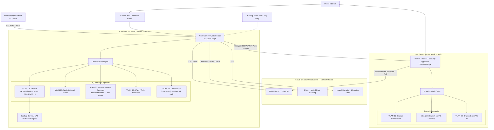

```mermaid
graph TD
    %% ===== External / WAN =====
    Internet[Public Internet]
    ISP[Carrier ISP — Primary Circuit]
    BackupISP[Backup ISP Circuit - HQ Only]

    %% ===== Cloud & SaaS =====
    subgraph Cloud [Cloud & SaaS Infrastructure — Vendor-Hosted]
        M365[Microsoft 365 / Entra ID]
        Fiserv[Fiserv Hosted Core Banking]
        LoanSaaS[Loan Origination &amp; Imaging SaaS]
    end

    %% ===== Remote Access =====
    Remote[Remote / Hybrid Staff<br>~30 users] -- "SSL VPN + MFA" --> HQ_FW

    %% ===== Charlotte HQ =====
    subgraph HQ [Charlotte, NC — HQ &amp; Main Branch]
        HQ_FW[Next-Gen Firewall / Router<br>SD-WAN Edge]
        HQ_Core[Core Switch / Layer 3]
        BackupNas[Backup Server / NAS<br>immutable copies]

        subgraph HQ_VLANs [HQ Internal Segments]
            VLAN10[VLAN 10: Servers<br>2x Virtualization Hosts, DCs, File/Print]
            VLAN20[VLAN 20: Workstations / Tellers]
            VLAN30[VLAN 30: VoIP &amp; Security Cameras<br>documented risk — see notes]
            VLAN40[VLAN 40: ATMs / Teller Machines]
            VLAN99[VLAN 99: Guest Wi-Fi<br>internet-only, no internal path]
        end

        HQ_FW --> HQ_Core
        HQ_Core --> VLAN10
        HQ_Core --> VLAN20
        HQ_Core --> VLAN30
        HQ_Core --> VLAN40
        HQ_Core --> VLAN99
        VLAN10 -.-> BackupNas
    end

    %% ===== Manhattan Branch =====
    subgraph NY_Branch [Manhattan, NY — Retail Branch]
        NY_FW[Branch Firewall / Security Appliance<br>SD-WAN Edge]
        NY_Switch[Branch Switch / PoE]

        subgraph NY_VLANs [Branch Segments]
            NY_V20[VLAN 20: Branch Workstations]
            NY_V30[VLAN 30: Branch VoIP &amp; Cameras]
            NY_V99[VLAN 99: Branch Guest Wi-Fi]
        end

        NY_FW --> NY_Switch
        NY_Switch --> NY_V20
        NY_Switch --> NY_V30
        NY_Switch --> NY_V99
    end

    %% ===== WAN & Site Connectivity =====
    Internet --> ISP
    ISP --> HQ_FW
    BackupISP -.-> HQ_FW
    HQ_FW -- "Encrypted SD-WAN / IPsec Tunnel" --> NY_FW
    NY_FW --> Internet

    %% ===== Cloud & SaaS Connectivity =====
    HQ_FW -- "TLS / SASE" --> M365
    HQ_FW -- "Dedicated Secure Circuit" --> Fiserv
    HQ_FW -- "TLS" --> LoanSaaS
    NY_FW -- "Local Internet Breakout / TLS" --> M365
```
